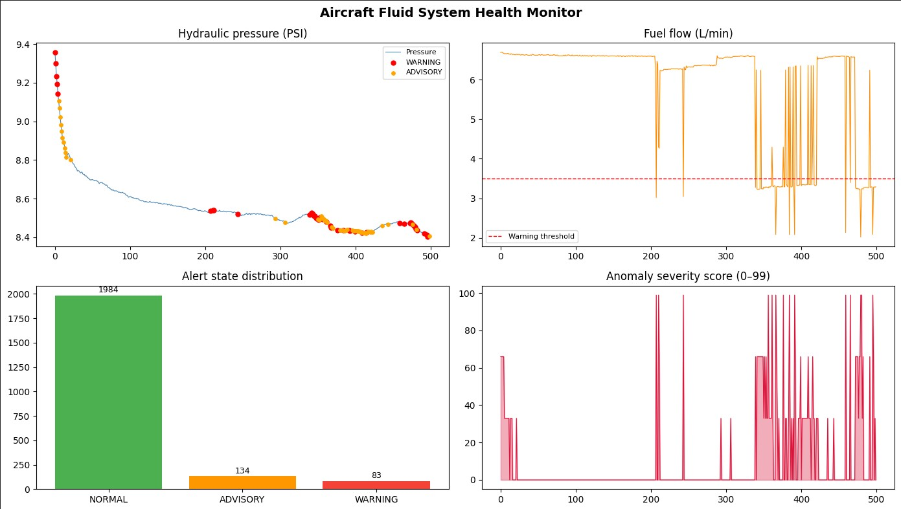

# ✈️ Aircraft Fluid Health Monitoring — Anomaly Detection


## Overview
An unsupervised ensemble machine learning system that monitors aircraft
hydraulic and fuel sensor data in real-time to detect anomalies before
they escalate into failures.

## Problem Statement
Aircraft fluid system failures are a leading cause of in-flight incidents.
Early detection using sensor telemetry can prevent costly unscheduled
maintenance and improve safety margins.

## Approach
| Model | Type | Role |
|---|---|---|
| Isolation Forest | Tree-based | Primary anomaly scorer |
| One-Class SVM | Kernel-based | Secondary detector |
| KDE | Statistical | Fuel-flow distribution check |
| **Ensemble (majority vote)** | **Combined** | **Final prediction** |

## Results
| Metric | Value |
|---|---|
| Precision | 2% |
| Recall | 2% |
| Overall F1 Score | 92% |

## Key Features
- Rolling window feature engineering (mean, std, lag, delta)
- SHAP explainability for individual anomaly diagnosis
- 3-tier alert system: NORMAL → ADVISORY → WARNING
- Visual dashboard with real-time severity scoring

## Setup
```bash
git clone https://github.com/yourusername/aircraft-fluid-anomaly-detection
cd aircraft-fluid-anomaly-detection
pip install -r requirements.txt
jupyter notebook notebook/aircraft_anomaly_detection.ipynb
```

## Dashboard


## Proposed CAD model
-  retrofit sensor platform using edge AI across hydraulic, landing gear, and fuel systems. Honeywell backs the hardware side. FAA/DGCA controls whether the product can legally fly.


### Proposed Markets and Segmentation
## Segment 1: Commercial Passenger Airlines
- Customer Profile: Airlines focused on daily passenger travel.
- Segmentation by Need: to eliminate turnaround time delays caused by discovering hydraulic leaks during pre-flight checks

## Segment 2: Cargo & Logistics
- Customer Profile: Companies managing shipping and cargo fleets
- Segmentation by Need: the segment is focused on avoiding grounded aircraft and preventing schedule disruptions
 
## Segment 3: MRO Providers
- Customer Profile: Third-party companies contracted for aircraft maintenance.
- Segmentation by Need: They need tools or processes that make identifying issues faster.


